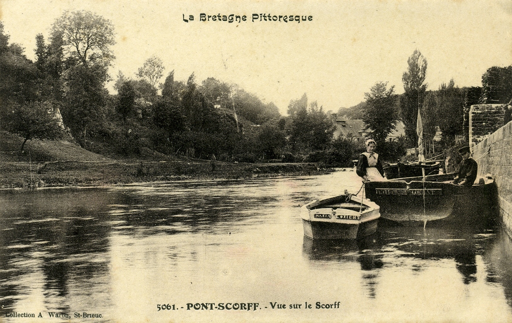
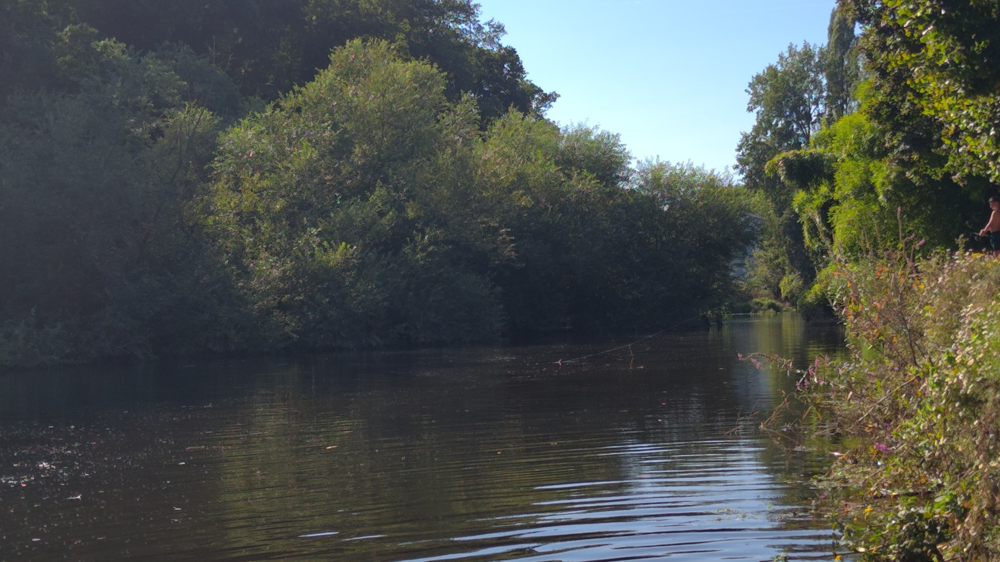

<!--  Copyright (C) 2015-2025 COMITE HISTOIRE ET PATRIMOINE DE CLEGUER / PONT SCORFF -->

# La Cale du Bas Pont-Scorff à Cléguer?

Derrière le mur on distingue les tas de bois qui étaient stockés dans le jardin de Jean-Marie Adol, ancien maire de Cléguer.

*Vers 1900, carte postale, collection privée*

*En 2025, photo de Pierre-Loup Tristant*

---

Un texte de Pierre-Loup Tristant

Publié sur [la page Facebook du Comité d'Histoire](https://www.facebook.com/comitehistoire56620) le 14 septembre 2025.

Copyright &copy; Comité Histoire et Patrimoine de Cléguer Pont-Scorff
