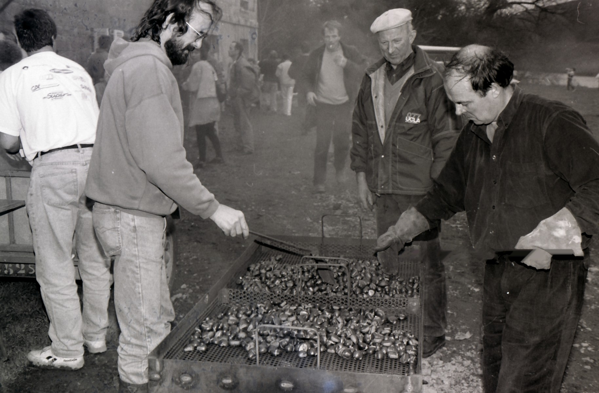

<!--  Copyright (C) 2015-2025 COMITE HISTOIRE ET PATRIMOINE DE CLEGUER / PONT SCORFF -->

# Archives de la Fête de l'Automne

Le comité Histoire et patrimoine Cléguer / Pont-Scorff vous attend ce dimanche 19 octobre à Saint-Urchaud à Pont-Scorff. Nous serons présents durant tout l'après-midi à la fête de l'automne pour vous en dire plus sur le manoir et le port de Pont-Scorff. L'histoire c'est aussi cette manifestation créée par Tier ha tud en novembre 1994... Sur ce cliché de la première édition où les châtaignes grillées régalaient déjà le public on peut notamment apercevoir Georges Névannen avec la casquette pilier de l'association et en arrière-plan Luc Offredo micro en main pour assurer l'animation

*La Fête de l'Automne 1994 au Manoir de Saint-Urchaud. Photo de collection privée, Yvonnick Le Coupannec*

---

Un texte d'Yvonnick Le Coupannec.

Publié sur [la page Facebook du Comité d'Histoire](https://www.facebook.com/comitehistoire56620) le 18 octobre 2025.

Copyright &copy; Comité Histoire et Patrimoine de Cléguer Pont-Scorff
