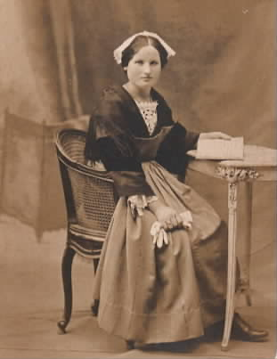
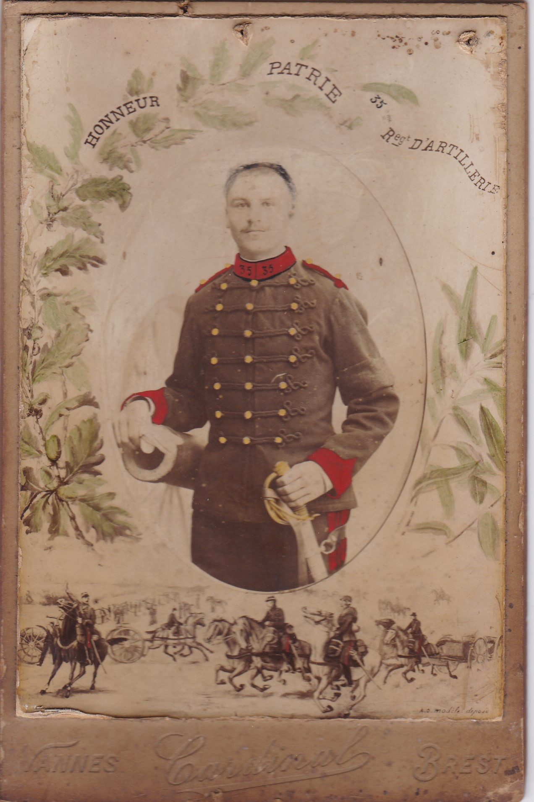

<!--  Copyright (C) 2015-2025 COMITE HISTOIRE ET PATRIMOINE DE CLEGUER / PONT SCORFF -->

# Fernande Herpe, la fille du sabotier

Je m'appelle Fernande, Fernande Herpe. Je suis née en 1907 à la Vraie Croix, près de Vannes. 

Quand nous arrivons à Cléguer, dans le village de Kerguendo, nous vivons dans une hutte en ajonc recouverte de chaume. Papa qui se prénomme Joachim est sabotier et il travaille à la lisière des bois. Nous sommes 5 enfants, il y a Emile puis Joseph, Augustine, moi Fernande et Marie-Françoise.

Papa a 40 ans quand arrive ce jour terrible du 2 aout 1914. C’est la mobilisation de tous les hommes âgés de 20 à 48 ans, soit plus de 3 millions d'hommes qui partent à la guerre. Les Allemands, les boches comme on dit, viennent nous envahir. Alors, il va rejoindre le 113 ème régiment d'artillerie lourde. Il est canonnier. Ma plus jeune sœur a tout juste 1 an.

En partant, il nous dit que la guerre ne sera pas longue, pour Noël il sera revenu. C'est le haut commandement qui l'affirme, ce sera une guerre courte. Ils disent que la majorité des blessés le seront par balles et qu'il y aura peu de blessures graves. Le 1er Noël arrive, puis le second et papa n'est pas revenu... Il n'est jamais revenu. 
Après sa mort, survenue le 14 février 1916, maman s'installe dans la rue du Temple au Bas Pont-Scorff. Parce que nous vivons dans une grande pauvreté, seuls avec maman, l'Etat nous adopte et nous devenons pupilles de la Nation.

Mon frère ainé, Emile, devient sabotier à son tour et Joseph s’engage comme mousse dans la marine, il a 13 ans. Je vais à l'école paroissiale de Pont-Scorff où les enseignantes religieuses me forment à la couture et la fabrication de chapeaux. Pour ma part, J’ai la chance incroyable d’être sélectionnée, parmi les Pupilles de la Nation, par une commission américaine de Boy Scouts. Elle m’offre une allocation et longtemps je vais écrire et remercier ces américains pour leur aide. Un article paraitra dans le journal « The Times » dans l’état de Louisiane aux États Unis à plus de 7000 kms de Cléguer. Une photo me représente avec mon costume breton de la région de Vannes. 

Maman ne parle jamais de papa, personne ne parle de la guerre à la maison. Il ne faut rien dire, c’est comme ça... Sur la fiche militaire de papa, il est noté « mort de maladie contractée en service ». Que s'est-il passé ?  Papa était en bonne santé en partant ! Est-ce le typhus ? ou bien la fièvre des tranchées, cette maladie transmise par les poux, présents sur tous les vêtements ? Ou la dysenterie, qui est si contagieuse avec cette fièvre intense et ses douleurs terribles au ventre, ses vomissements, ses diarrhées, ses vertiges. Dans quelles conditions à t'il passé cet hiver 1915 ? Dans la boue des tranchées avec cette humidité permanente qui lui colle à la peau car le tissu des vareuses et des pantalons bleus horizon n’est absolument pas imperméable. Rien ne sèche. Et l’eau, cette eau qui manque cruellement ! Certains soldats boivent n'importe quel liquide. Ils ont tellement soif ! Un trou rempli d’eau verte qui sent le cadavre peut les désaltérer ! Et le froid ! Les nuits froides durant les gardes où il ne faut surtout pas s’arrêter de marcher, même écrasé par la fatigue : il faut marcher, toujours marcher, celui qui s’arrête ne se réveille pas. Alors une pneumonie, une tuberculose l’aurait-elle emporté ?

Le saurai-je un jour ? Plus de 100 000 soldats sont morts de maladie et tu es l’un d’entre eux.
Quand je serai grande j’irai me recueillir sur ta tombe. Elle porte le numéro 1529 dans la nécropole du village de Tracy le Mont dans l’Oise.

J’avais 7 ans quand tu es parti pour la Grande Guerre et tu n’es pas rentré pour Noël.

*Fernande Herpe à 14 ans (1923). Collection Famille Herpe.*

*Joachim Herpe, service militaire vers 1912, photo de collection privée, famille Herpe.*

[Article du Shreveport Times - Dimanche 10 avril 1921 - Page 15](https://www.newspapers.com/image/208848230)

---

Un texte de Sylvie Lelgoualc'h.

Lu par Sylvie Lelgoualc'h lors des comémorations du 11 novembre 2025 à Cléguer.

Publié sur [la page Facebook du Comité d'Histoire](https://www.facebook.com/comitehistoire56620) le 11 novembre 2025.

Copyright &copy; Comité Histoire et Patrimoine de Cléguer Pont-Scorff
