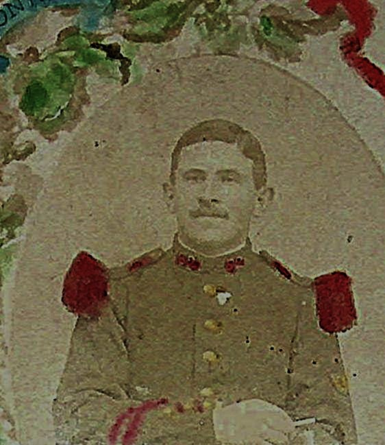
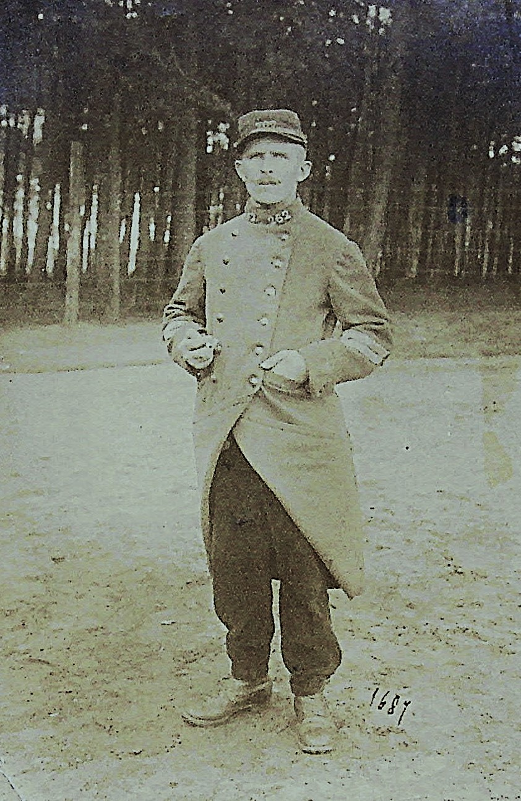

<!--  Copyright (C) 2015-2025 COMITE HISTOIRE ET PATRIMOINE DE CLEGUER / PONT SCORFF -->

# Joseph Bocher Mort pour la France à 29 ans

(Voix de Joseph)

Je m’appelle Joseph Bocher, de Pont-Scorff. J’ai 29 ans.

En ce jour estival du 27 août 1914, la poussière de la route colle à nos uniformes et le soleil des confins de la Somme et du Pas-de-Calais pèse sur nos épaules. Avec les gars de la région, nous formons le 262ème Régiment d'Infanterie. Mon petit frère, Pierre, est là lui aussi. Sa présence à la fois me rassure et décuple mon angoisse.
Débarqués la veille à Arras, nous avons entamé une marche harassante vers le sud en direction de Peronne. L'ordre est simple : nous devons renforcer les lignes françaises qui, nous le comprenons à demi-mot, reculent depuis la Belgique.

Comme il me paraît loin, ce mois de juillet. Si loin, le parfum des foins coupés et la sueur honnête du labeur dans les champs. Je repense à ce 5 août, le jour où j'ai quitté Kervennec, mon village, pour le train qui nous attendait à Lorient. Au bout de quelques mètres, une angoisse m'a serré le cœur, un pressentiment lourd. Et si le destin venait me réclamer comme mon aïeul ? Cet autre Joseph Bocher, soldat de la Grande Armée, mort de froid et d’épuisement pendant l’effroyable retraite de Russie. Porter le même prénom que lui est-il un héritage ou une malédiction ?
Ce jour-là, au bout du chemin, je me suis retourné. J’ai regardé mon village et une larme a tracé un sillon dans la poussière de mon visage, en pensant que c’était peut-être pour la dernière fois.
Aujourd’hui, la colonne s'arrête dans un grincement de cuir et de métal. Un ordre bref fuse. Le 6 ème bataillon bifurque, en direction de Raucourt. C'est la compagnie de mon frère, Pierre, que je regarde s'éloigner, marchant dans la boue d’un chemin étroit, jusqu'à disparaître.

Moi, je continue avec le 5ème. La route s'enfonce vers Sailly-Saillisel.

C'est là que nous recevons le baptême du feu. Le mot "bataille" est trop faible. C'est un déchaînement. Un vacarme de fer et de feu tel que nos esprits ne peuvent le concevoir. L'air est déchiré par les sifflements. L'infanterie, les mitrailleuses, l'artillerie... tout crache en même temps. Nous sommes pris dans un feu écrasant. Pour chaque homme de chez nous, ils sont cinq en face. Les rangs s'éclaircissent à vue d'œil. Le soir commence à tomber. L'air est irrespirable. Nous ne pouvons plus tenir.

L'ordre de battre en retraite arrive enfin, dans le chaos. Mais pour moi, il est trop tard. Je suis tombé. Mon chemin s'arrête ici, dans ce champ de la Somme.”
 
(Voix de Pierre)

"Je m’appelle Pierre Bocher, de Pont-Scorff. J’ai 27 ans.
J’ai vu mon grand frère Joseph pour la dernière fois ce jour du 27 août 1914, sur cette route où nos destins se sont séparés.
Pour ma part, j’ai été fait prisonnier ce même jour. Je resterai 51 mois au camp Sienne près de Paderborn, en Westphalie.
Je serai libéré le 24 décembre 1918. Et contrairement à Joseph, j’aurai la chance de revoir notre village de Kervennec."

*Joseph Bocher, service militaire vers 1907. Collection Famille Bocher-Tristant.*
*Copyright &copy; 2025 Yvonnick Le Coupannec*

*Pierre Bocher, prisonnier au camps de Sienne (Paderborn) en Westphalie. Collection Famille Bocher-Tristant.*
*Copyright &copy; 2025 Yvonnick Le Coupannec*

---

Un texte de Pierre-Loup Tristant.

Lu par Aubin et Pierre-Loup Tristant lors des comémorations du 11 novembre 2025.

Copyright &copy; Comité Histoire et Patrimoine de Cléguer Pont-Scorff
