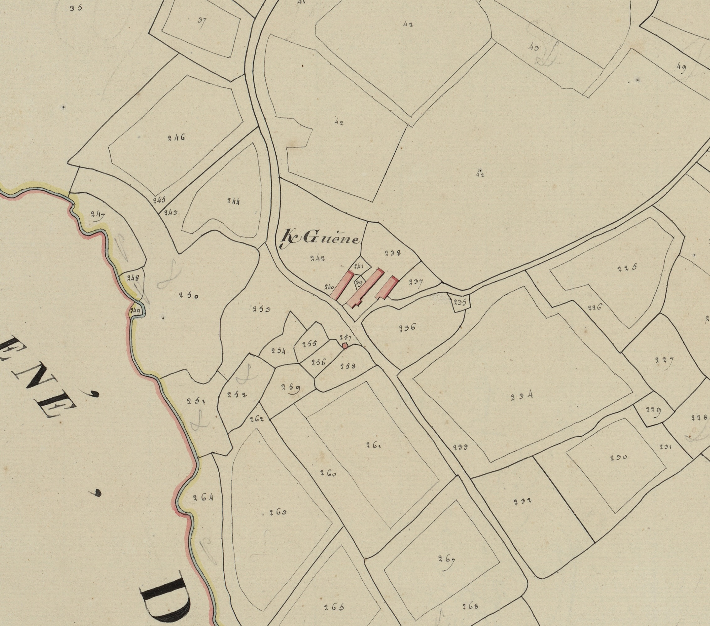

<!--  Copyright (C) 2015-2025 COMITE HISTOIRE ET PATRIMOINE DE CLEGUER / PONT SCORFF -->

# Kerguen

C’est un des toponymes les plus anciens de la commune. En effet, nous trouvons ce nom de lieu, écrit en latin, dès le XIIe siècle sous la forme Villa Albi vers 1167, ensuite K/anguen 1448, 1449, 1508, 1540, 1559, 1565, 1571, K/guen 1642, 1645, 1671, lieu, manoir et mettayrie noble de Queranguen ou Querguen 1683, K/enguen et lieu et métairie de K/guen 1754, K/guen 1771 et 1790, K/guene cadastre de 1818.

Ce village avait fait l’objet d’une donation à l’Abbaye de Saint-Croix de Quimperlé vers 1167. Il a, par la suite, appartenu au prieuré de Lannenec en Ploemeur.

Ce toponyme associe Ker (village) au nom de personne Anguen (Le Blanc) ce qui correspond bien à Villa Albi (La Ville au Blanc) toponyme que l’on trouve également dans un quartier de Vertoux (44) et dans le village de Taupont (56).

Le patronyme de K/anguen est attesté dans la commune en 1462.

*Section E de Kervic, 1ere feuille, 1818. Patrimoines & Archives du Morbihan  cote 3 P 225 13*

---

Un texte de Michel Pothier. 

Source: « Des sources de l’Ellé à l’Île de Groix », Jean-Yves Plourin et Pierre Holloco, édition Emgleo Breiz, 2014.

Publié sur [la page Facebook du Comité d'Histoire](https://www.facebook.com/comitehistoire56620) le 15 mars 2026.

Copyright &copy; Comité Histoire et Patrimoine de Cléguer Pont-Scorff