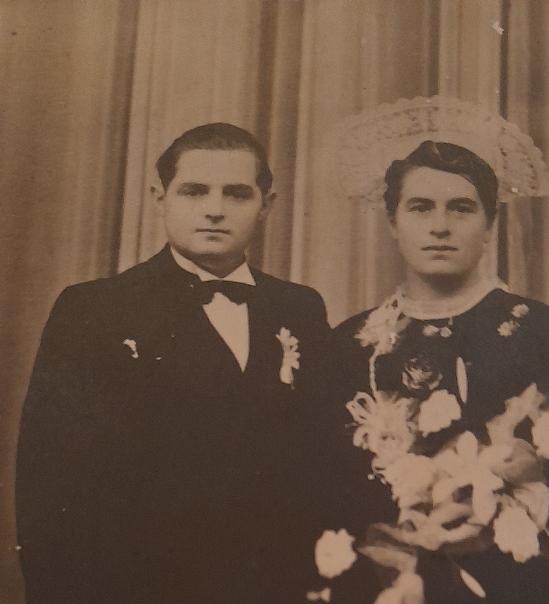

<!--  Copyright (C) 2015-2025 COMITE HISTOIRE ET PATRIMOINE DE CLEGUER / PONT SCORFF -->

# Le mariage d'Anne-Marie sous l'occupation à Pont-Scorff

Je suis bien petite lorsque ma grande sœur, Anne-Marie, se marie le jeudi 19 novembre 1942, à Pont-Scorff. La guerre est là, les Allemands aussi, mais moi je ne les vois pas.

Anne-Marie qui a dix-neuf ans de plus que moi est la première de mes sœurs à se marier. Elle porte son magnifique costume breton et sa belle coiffe.  Elle sera la seule à se marier ainsi. Peut-être, au fond, aurait-elle préféré la nouvelle mode qui apparaît alors : la robe blanche. Une autre de mes sœurs, Marie, s’est fait confectionner sa tenue de noce dans une toile de parachute trouvée dans les champs après un largage de matériel. C’était de la soie….

On se marie les mois d'hiver quand les champs demandent moins de travaux. On évite les mois de mars et décembre, mois du carême et de l’avent, et aussi le mois de mai, celui de la Vierge Marie : par superstition, les femmes craignent de ne pas avoir d’enfants. Dans nos campagnes, la religion et les saisons rythment les vies.

Pour ma part, une autre de mes soeurs, Célestine, couturière, me façonne un splendide tablier écossais, orné d’un gros nœud dans le dos. J’enfile aussi une paire de sabots jaunes vernis, tout neufs. Je suis si fière, je me trouve la plus belle du monde. Quelle déception pourtant, lorsque j'accueille Julienne, la cuisinière, et qu’elle ne me regarde même pas… Je n'ai pas oublié cette petite peine d'enfant.

Julienne vient préparer le repas de noce : une soupe, un pâté, puis un rôti de porc accompagné de pommes de terre, et un far pour finir, le tout arrosé de bon cidre, le pur jus, celui des grands événements. Et bien sûr, à la fin du repas, on n’oublie pas la goutte.

Les mariés et les jeunes enfants se rendent à l’église de Pont-Scorff en charrette. La noce suit à pied.  Après la cérémonie religieuse, le repas se tient dans la grange de la ferme de Mané Guennec, où nous habitons. Cinquante invités prennent place autour des tables dressées. La cour est soigneusement nettoyée, balayée, et l’on installe une barrique pour que l’accordéoniste puisse monter dessus et faire danser tout le monde. On chante beaucoup pendant les mariages. Chacun a son répertoire et veut le faire partager. 

Anne-Marie a rencontré son futur mari par l’intermédiaire du darbodeur, l’entremetteur du pays. Il connaît bien les jeunes gens et propose aux parents des unions possibles. Sur les photos de noce, c’est lui que l’on voit devant, à coté des mariés, un ruban attaché à sa canne. Je me souviens, je ne dois pas sourire sur les photos et surtout pas montrer ses dents !

Je me cachais quand je le voyais arriver dans la maison, j'étais triste et furieuse contre lui. je ne sais pas bien pourquoi. J’avais l’impression qu’il venait emporter mes sœurs. Il est venu quatre fois à la ferme ! Mais c'était comme ça partout, alors on ne discutait pas. Certains mariages étaient heureux, d’autres moins… comme aujourd’hui, finalement.

À la fin de la fête, la mariée part vivre dans sa belle-famille, à Caudan. Là-bas, tout le monde dort dans la même pièce : le père, veuf, et ses deux fils célibataires. Il n’y a aucune intimité pour ma sœur. C'est une nouvelle vie commence pour elle.

C’est ma cousine Marguerite, de six ans mon aînée, qui m’a plus tard raconté certains détails de ces événements. Ma famille a aujourd’hui disparue, mais les souvenirs demeurent.

*Photo de mariage d'Anne Marie, Collection Famille Gragnic* 

---

Un texte de Sylvie Lelgoualc'h.

Source: Souvenirs de Marie-Louise Gragnic.

Publié sur [la page Facebook du Comité d'Histoire](https://www.facebook.com/comitehistoire56620) le 22 mars 2026.

Copyright &copy; Comité Histoire et Patrimoine de Cléguer Pont-Scorff
