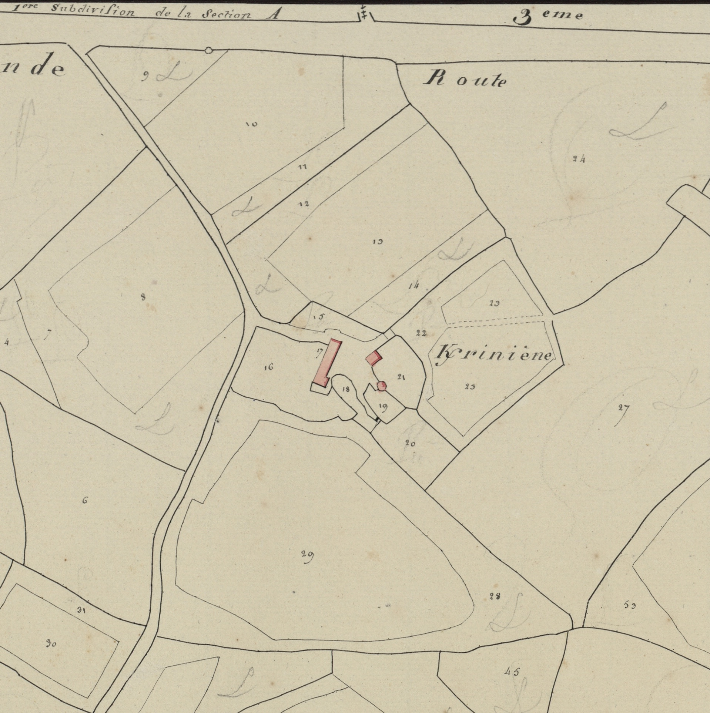
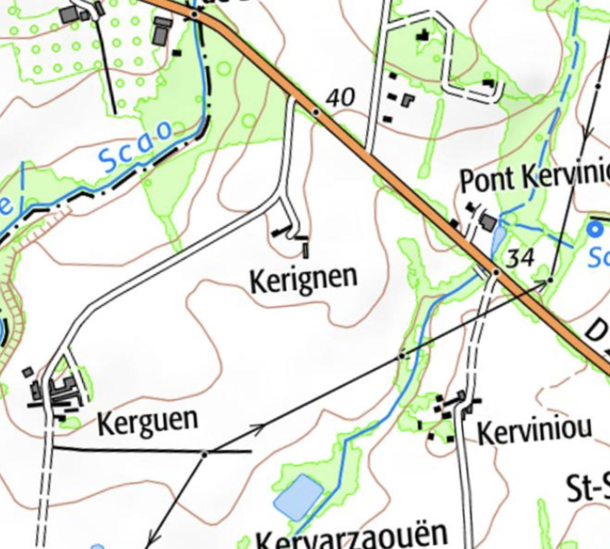

<!--  Copyright (C) 2015-2025 COMITE HISTOIRE ET PATRIMOINE DE CLEGUER / PONT SCORFF -->

# Kerignen

Toponyme plus récent mais plus difficile à traduire. La première graphie connue n’apparait qu’en 1508 K/rignen puis K/hignan 1587, 1671, 1680, Mettayerie noble de Querhignen 1683, K/hinnen 1701, 1702, K/hignen 1762, K/inen 1762, K/hinien 1772, Cassini Kerbinen, K/hinnen 1790, K/iniene cadastre 1818.

Ce toponyme associe Ker (village) à un nom de personne non repéré. Faut-il le rapprocher de Kerignan en Queven. Dans ce cas on peut y trouver la trace d’un Saint Ignan (Aignan en français).

*Section E de Kervic, 1ere feuille, 1818. Patrimoines & Archives du Morbihan  cote 3 P 225 13*

*Carte SCAN25 © IGN 2025 – Copie et reproduction interdite*

---

Un texte de Michel Pothier. 

Source: « Des sources de l’Ellé à l’Île de Groix », Jean-Yves Plourin et Pierre Hollocou, édition Emgleo Breiz, 2014.

Publié sur [la page Facebook du Comité d'Histoire](https://www.facebook.com/comitehistoire56620) le 29 mars 2026.

Copyright &copy; Comité Histoire et Patrimoine de Cléguer Pont-Scorff