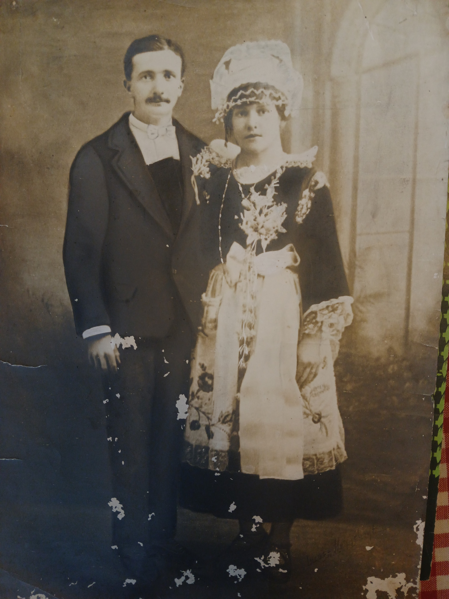
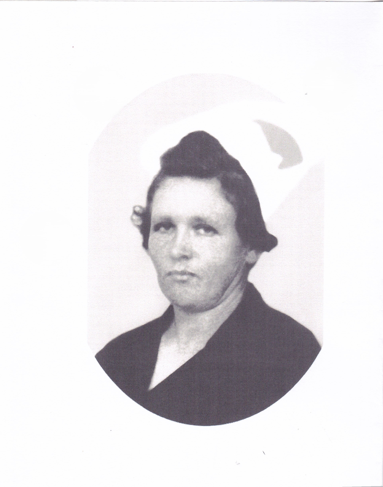

<!--  Copyright (C) 2015-2025 COMITE HISTOIRE ET PATRIMOINE DE CLEGUER / PONT SCORFF -->

# Anne-Marie Bardouil

Depuis l'été 1940, le territoire français est occupé par les soldats du IIIᵉ Reich. Dans le Morbihan, Lorient est un objectif militaire stratégique ce qui a des répercussions sur les communes environnantes.

Les années passent, rythmées par les sirènes anti-aériennes, les tickets de rationnement et la peur. Enfin, arrive 1944 où une partie de la France est libérée. Mais la région se retrouve enfermée dans ce que l’on appelle la Poche de Lorient qui reste sous contrôle allemand. Les forces alliées et les FFI sont présents. Les combats
se rapprochent des villages. L'ennemi pilonne les positions alliées et résistantes à Landévant, Brandérion, Languidic, Inzinzac et Cléguer. L’artillerie tonne sans interruption et les clochers des villages servent de points de repère essentiels.

Cléguer est touché le 3 avril 1945. L'hypothèse d'un raid aérien allié n'est pas envisagée, car aucune archive n'en fait mention. De plus, ce sont des obus fusants, utilisés par les forces d'occupation pour des tirs antipersonnel, qui atteignent la commune. Ces projectiles présentent un danger considérable. L'explosion
propulse des fragments métalliques qui se dispersent sur une vaste étendue. Ils provoquent des blessures multiples et graves. Les bâtiments sont épargnés, mais pas les hommes. Il n'est pas impératif de viser avec précision afin de neutraliser tout un secteur.

Il est 16 h 30, Anne Marie Bardouil (née Tamic) revient du lavoir et s'apprête à étendre son linge à coté de la maison située dans le bourg de Cléguer, face à l'église et son clocher. Il fait beau, le linge va sécher vite pense t'elle ! Soudain, elle entend ce pilonnage et tente de se protéger dans un abri à proximité, en vain. Un obus éclate juste à côté d'elle, entraînant des blessures fatales au niveau de la tête. C'est Louisette, sa deuxième fille, qui l'attend pour boire un café, qui la retrouve inerte sur le sol. Anne-Marie a 43 ans. Elle laisse derrière elle, un mari, 4 enfants, dont le plus jeune Amédée a 13 ans, tous inconsolables après cette tragédie.

Quelques semaines plus tard, le 10 mai 1945, la guerre s’achève enfin dans la région. A Caudan, le général allemand Fahrmbacher remet son pistolet au général américain Kramer.

Le monument aux morts de Cléguer porte les noms de 101 personnes. Parmi eux, une seule femme : Anne-Marie Bardouil. En son honneur et pour ne pas oublier ce drame, une rue du bourg porte son nom.

*Photo de mariage en 1924*

*Photo d'identitée vers 1945*

---

Un texte de Sylvie Lelgoualc'h.

Lu par Sylvie Lelgoualc'h lors des comémorations du 8 mai 2026.

Publié sur [la page Facebook du Comité d'Histoire](https://www.facebook.com/comitehistoire56620) le 8 mai 2026.

Copyright &copy; Comité Histoire et Patrimoine de Cléguer Pont-Scorff